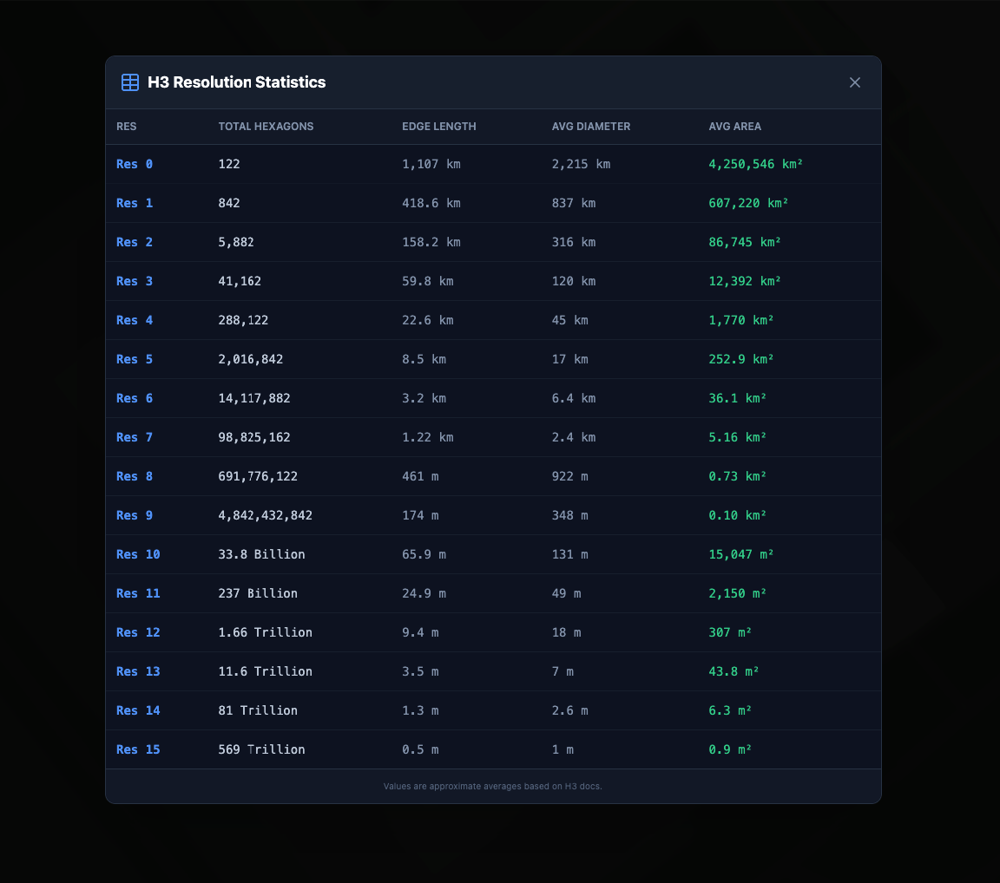

# H3 Index Visualizer

An interactive web application for visualizing and exploring Uber's H3 hexagonal hierarchical geospatial indexing system. Built with vanilla JavaScript and featuring a modern dark-themed UI with advanced density visualization capabilities.

**Live Demo:** [https://h3-map.senel.tr](https://h3-map.senel.tr)


## Features

The application offers two main modes accessible via tabs:
- **H3 Explorer**: Search and visualize individual H3 cells with neighborhood analysis
- **Density Viewer**: Upload and visualize spatial density data with heat maps and aggregations

### Core Functionality
- **Dual Input Modes**
  - Search by H3 ID (Hexadecimal or Decimal format)
  - Search by Latitude/Longitude coordinates
- **Interactive Map**
  - Click anywhere on the map to visualize H3 cells
  - Dynamic resolution based on zoom level
  - Centered on Anıtkabir, Ankara, Turkey (default view at Resolution 11)

### Visualization
- Real-time hexagon boundary rendering
- Cell center point markers
- Color-coded visualization with dark theme
- Parent layer hierarchy (zoom out to see larger cells)
- **K-Factor Neighborhood Rings**
  - Display neighboring cells within 1-10 rings around selected cell
  - Uses H3's `gridDisk` algorithm for accurate neighbor detection
  - Graduated opacity based on distance (closer neighbors more visible)
  - Interactive popups showing neighbor cell IDs and ring distance
- Detailed cell information display

### Density Viewer
- **CSV Data Upload**
  - Upload custom density data (user counts, population, sales, etc.)
  - Auto-validates H3 codes and resolution consistency
  - Supports files with thousands of cells (tested with 2,249+ cells)
- **Heat Map Visualization**
  - Percentile-based 5-tier color gradient (Blue → Green → Yellow → Orange → Red)
  - Automatic color scaling based on data distribution
  - Density labels displayed on each hexagon with abbreviated format (1.2K, 3.5M)
- **Parent Cell Aggregation**
  - Automatic SUM aggregation when navigating to parent cells
  - Maintains color scale consistency across resolution levels
  - Preserves data integrity during resolution changes
- **Auto-Focus**
  - Automatically centers map on highest density cell after upload
  - Smart zoom level calculation based on data resolution
- **Dataset Statistics**
  - Real-time display of min/max/count values
  - Color scale legend with percentile thresholds
  - File information and resolution details
- **Tab-Based Interface**
  - Separate "Density Viewer" tab for clean UI organization
  - Independent from H3 Explorer functionality
  - Clear data management with one-click reset

### Advanced Features
- **Multi-Language Support**
  - Automatic browser language detection
  - Supported languages: English, Turkish, German
  - Defaults to English for unsupported languages
- **"Locate Me" Functionality**
  - Uses browser geolocation to find your current H3 cell
  - Automatically calculates at Resolution 15 (maximum detail)
- **Resolution Reference Table**
  - Complete H3 resolution statistics (Res 0-15)
  - Hexagon counts, edge lengths, areas
- **Format Support**
  - Hexadecimal H3 IDs
  - Decimal (64-bit) H3 IDs with BigInt support
  - Directed Edges and Vertex handling

### User Experience
- **Auto-Synchronization**: Input fields automatically sync between tabs
  - Enter H3 ID → see coordinates
  - Enter coordinates → see H3 ID
- **Smart Resolution Selection**
  - Coordinate lookups use Resolution 15 for maximum detail
  - Map clicks use zoom-appropriate resolution
- **Responsive Design**: Works on desktop and mobile devices
- **Dark Theme**: Eye-friendly interface with inverted map tiles

## Screenshots

### Main Interface

*The main interface showing the interactive map centered on Anıtkabir, Ankara with H3 hexagonal cells overlaid.*

### Cell Details View

*Detailed view showing H3 cell information, resolution, area, center coordinates, and parent layer hierarchy.*

### Resolution Reference Table

*Complete H3 resolution statistics table showing hexagon counts, edge lengths, diameters, and areas for all 16 resolution levels.*

## Technologies Used

- **Mapping**: [Leaflet.js](https://leafletjs.com/) v1.9.4
- **H3 Library**: [h3-js](https://github.com/uber/h3-js) v4.1.0
- **Styling**: [Tailwind CSS](https://tailwindcss.com/) (CDN)
- **Icons**: [Lucide Icons](https://lucide.dev/)
- **Base Maps**: CartoDB Light tiles with inverted colors for dark mode

## How to Use

### Search by H3 ID
1. Click the **"By H3 ID"** tab
2. Select format (Hexadecimal or Decimal)
3. Enter an H3 index (e.g., `8928308280fffff`)
4. Click search or press Enter
5. View the hexagon on the map and detailed information

### Search by Coordinates
1. Click the **"By Lat/Lon"** tab
2. Enter latitude and longitude (e.g., `39.925`, `32.836944`)
3. Click **"Find H3 Cell"**
4. The app calculates the H3 cell at Resolution 15

### Interactive Features
- **Click on Map**: Instantly get the H3 cell for any location
- **Locate Me**: Click to find your current location's H3 cell
- **Parent Layers**: Click any parent cell to zoom out and explore larger hexagons
- **K-Factor Neighborhood Rings**: Use the dropdown to display neighboring cells
  - Select `k=1` to show immediate neighbors (~7 cells)
  - Select `k=2` to show cells within 2 rings (~19 cells)
  - Up to `k=10` for extensive neighborhood analysis (~331 cells)
  - Select "unset" to hide neighbors and show only the main cell
  - Neighbors rendered in blue (or orange in swap mode) with lower opacity
- **Swap Lat/Lon**: Debug button to swap coordinates if needed

### Exploring Neighborhoods
- **K-Factor Selection**: Use the dropdown below the format selection
- Select a k value (1-10) to visualize neighboring cells
- Neighbors are color-coded:
  - **Blue** neighbors in normal mode
  - **Orange** neighbors in swap mode
  - Main cell remains **green** (or **amber** in swap mode) with higher opacity
- Click on any neighbor cell's popup to see its details
- Great for understanding spatial relationships and H3 grid patterns

### Language Switching
- Use the language switcher in the header (TR/EN/DE)
- Language is auto-detected on first visit

### Using the Density Viewer
1. **Switch to Density Viewer Tab**
   - Click the **"Density Viewer"** tab at the top of the sidebar
   - This separates density visualization from H3 exploration

2. **Prepare Your CSV File**
   - Format: `h3code,density` (two columns)
   - H3 codes must be in hexadecimal format (e.g., `871ec9111ffffff`)
   - All cells must be the same resolution
   - Example:
     ```csv
     h3code,density
     871ec9111ffffff,698
     871ec9113ffffff,548
     871ec91adffffff,490
     ```

3. **Upload Density Data**
   - Click **"Load Density Data"** button
   - Select your CSV file
   - The app automatically:
     - Validates all H3 codes and resolution consistency
     - Calculates percentile-based color scale
     - Renders heat map with density labels
     - Centers map on highest density cell

4. **View Statistics**
   - Dataset information panel shows:
     - Filename and resolution
     - Total cell count
     - Min/Max density values
     - Color scale legend with thresholds

5. **Explore Parent Aggregations**
   - Click any parent cell in the info panel
   - Density values automatically aggregate (SUM) to parent resolution
   - Color scale recalculates for new resolution level

6. **Clear Data**
   - Click **"Clear Density Data"** button to reset
   - Returns to clean state, ready for new upload

### Converting Decimal H3 IDs to Hexadecimal
If your data uses decimal (unsigned long) H3 IDs, use the included conversion script:

```bash
# Convert from decimal format to hexadecimal
python3 convert_ulong_to_hex.py input.csv output.csv

# Example with sample data
python3 convert_ulong_to_hex.py sample_points.csv sample-density.csv
```

**Input format** (decimal):
```csv
608527532488130559,667
608527532521684991,657
```

**Output format** (hexadecimal):
```csv
h3code,density
871ec9111ffffff,667
871ec9113ffffff,657
```

## Installation

### Option 1: Direct Use
Simply open `index.html` in a modern web browser. All dependencies are loaded via CDN.

### Option 2: Local Server
For better development experience:

```bash
# Using Python 3
python -m http.server 8000

# Using Node.js
npx http-server

# Using PHP
php -S localhost:8000
```

Then visit `http://localhost:8000`

## Project Structure

```
h3-index-visualizer/
├── index.html                      # Main application (single-file)
├── convert_ulong_to_hex.py         # Utility to convert decimal H3 IDs to hex
├── sample-density.csv              # Sample density data (2,249 cells)
├── sample_points.csv               # Source data in decimal format
├── DENSITY_VIEWER_ACCEPTANCE_CRITERIA.md  # Feature requirements doc
├── images/                         # Screenshots and assets
│   ├── main-interface.png          # Main interface screenshot
│   ├── cell-details-view.png       # Cell details panel screenshot
│   └── resolution-table.png        # H3 resolution reference table
└── README.md                       # This file
```

## Configuration

### Default Settings
You can modify these settings in `index.html`:

- **Default Location**: Line ~925 (currently Anıtkabir, Ankara)
- **Default Resolution**: Line ~927 (currently Res 11)
- **Default K-Factor**: Line 485 (`currentKFactor = 'unset'`)
- **Coordinate Resolution**: Line ~624 (Res 15 for max detail)
- **Locate Me Resolution**: Line ~870 (Res 15)
- **Neighbor Colors**: Line 866-867 (blue `#3b82f6` or orange `#f97316`)
- **Neighbor Opacity**: Line 860-862 (graduated 0.15-0.05)

### Language Settings
- **Supported Languages**: `tr`, `en`, `de` (Line 347-350)
- **Default Language**: English with auto-detection (Line 356)

### Density Viewer Settings
- **Color Scale Tiers**: 5 percentile-based tiers (20%, 40%, 60%, 80%, 100%)
- **Color Gradient**: Blue → Green → Yellow → Orange → Red
  - Blue: `#3b82f6` (≤20th percentile)
  - Green: `#22c55e` (≤40th percentile)
  - Yellow: `#eab308` (≤60th percentile)
  - Orange: `#f97316` (≤80th percentile)
  - Red: `#ef4444` (>80th percentile)
- **Number Formatting**: Automatic abbreviation (1K, 1M, 1B)
- **Aggregation Method**: SUM for parent cells
- **Polygon Opacity**: 0.6 for filled areas

## CSV Format Reference

### Required Format
```csv
h3code,density
871ec9111ffffff,667
871ec9113ffffff,657
```

### Validation Rules
- ✅ **Two columns**: H3 code and density value
- ✅ **Hexadecimal format**: H3 codes must be in hex (not decimal)
- ✅ **Same resolution**: All cells must be the same H3 resolution
- ✅ **Non-negative values**: Density must be ≥ 0
- ✅ **Optional header**: First row can be `h3code,density` (auto-detected)

### Common Errors
- ❌ Mixed resolutions (e.g., mixing Res 7 and Res 8 cells)
- ❌ Invalid H3 codes (validated using `h3.isValidCell()`)
- ❌ Decimal format IDs (use `convert_ulong_to_hex.py` to convert)
- ❌ Missing values or malformed rows

### Duplicate Handling
- If the same H3 code appears multiple times, density values are **summed**
- A warning is logged to the console showing duplicate count

## H3 Resolution Reference

| Resolution | Avg Area    | Edge Length | Use Case                |
|------------|-------------|-------------|-------------------------|
| 0          | 4,250,546 km² | 1,107 km    | Continental             |
| 5          | 252.9 km²   | 8.5 km      | Large cities            |
| 8          | 0.73 km²    | 461 m       | Neighborhoods           |
| 11         | 2,150 m²    | 24.9 m      | Buildings (default)     |
| 12         | 307 m²      | 9.4 m       | Building level          |
| 15         | 0.9 m²      | 0.5 m       | Maximum detail          |

### K-Factor Performance Guide

| k Value | Approximate Cells | Use Case                        |
|---------|-------------------|---------------------------------|
| k=1     | 7 cells          | Immediate neighbors             |
| k=2     | 19 cells         | Local neighborhood              |
| k=3     | 37 cells         | Extended area                   |
| k=5     | 91 cells         | District-level analysis         |
| k=7     | 169 cells        | Large area coverage             |
| k=10    | 331 cells        | Maximum neighborhood analysis   |

*Note: Actual cell count may vary slightly due to pentagon distortions and grid topology.*

## Browser Support

- Modern browsers with ES6+ support
- Geolocation API for "Locate Me" feature
- BigInt support for decimal H3 IDs

### Recommended Browsers
- Chrome/Edge 90+
- Firefox 88+
- Safari 14+

## Contributing

Contributions are welcome! Feel free to:
- Report bugs via GitHub Issues
- Submit pull requests
- Suggest new features
- Improve documentation

## About H3

H3 is a hexagonal hierarchical geospatial indexing system developed by Uber. It provides:
- Efficient spatial indexing
- Multiple resolutions (0-15)
- Consistent hexagonal grid
- Fast neighbor lookups
- Global coverage

Learn more at [H3 Documentation](https://h3geo.org/docs/)

## License

This project is open source and available under the MIT License.

## Author

**Anil Dursun Senel**
- Website: [senel.tr](https://senel.tr)
- GitHub: [@anilsnl](https://github.com/anilsnl)
- Live Demo: [h3-map.senel.tr](https://h3-map.senel.tr)

## Acknowledgments

- [Uber H3 Team](https://github.com/uber/h3) for the amazing geospatial indexing system
- [Leaflet](https://leafletjs.com/) for the mapping library
- [CartoDB](https://carto.com/) for the base map tiles
- [Lucide](https://lucide.dev/) for the beautiful icons

---

**Star this repository** if you find it useful! ⭐
